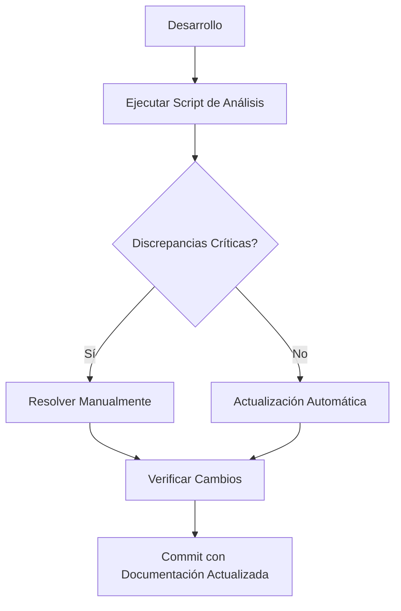

# 📋 PROTOCOLO DE ACTUALIZACIÓN DE DOCUMENTACIÓN
## SOUP Emprendimientos

**Versión:** 1.0  
**Fecha de creación:** 8 de Julio de 2025  
**Responsable:** Equipo de Desarrollo  
**Última actualización:** 8 de Julio de 2025

---

## 🎯 OBJETIVO

Este protocolo establece un proceso estandarizado para mantener la documentación del proyecto SOUP Emprendimientos sincronizada con el desarrollo, identificando automáticamente discrepancias y facilitando las actualizaciones necesarias.

---

## 📋 DOCUMENTOS DE REFERENCIA

### **Documentos Principales**
1. **`Documentación/DOCUMENTACION_TECNICA.md`** - Documentación técnica completa
2. **`Documentación/INDICE_ARCHIVOS_ACTUALIZADO.md`** - Índice de archivos del proyecto
3. **`debugging/HISTORIAL_DE_BUGS.md`** - Historial de bugs y soluciones
4. **`debugging/README.md`** - Guía de debugging y scripts
5. **`Documentación/Roadmap/ROADMAP_DEFINITIVO_MVP.md`** - Roadmap del proyecto

### **Documentos Secundarios**
- Scripts de debugging en `debugging/scripts/`
- Ejemplos y templates en `debugging/examples/`
- Reportes de actualización en `debugging/reportes/`

---

## 🔄 PROCESO DE ACTUALIZACIÓN

### **Fase 1: Análisis Automático**
**Responsable:** Script de actualización  
**Frecuencia:** Antes de cada commit importante

#### **Pasos:**
1. **Ejecutar script de análisis:**
   ```bash
   python debugging/scripts/actualizar_documentacion.py
   ```

2. **El script analiza:**
   - Estado actual del proyecto (archivos, endpoints, funcionalidades)
   - Estado de la documentación (completitud, fecha de actualización)
   - Discrepancias entre ambos estados
   - Base de datos (tablas, registros, enums)

3. **Genera reporte con:**
   - Estadísticas del proyecto
   - Discrepancias identificadas (alta, media, baja prioridad)
   - Plan de actualización recomendado
   - Funcionalidades implementadas vs documentadas

### **Fase 2: Revisión de Discrepancias**
**Responsable:** Desarrollador  
**Frecuencia:** Después del análisis automático

#### **Criterios de Priorización:**

**🔴 ALTA PRIORIDAD (Crítico)**
- Funcionalidades implementadas no documentadas
- Endpoints nuevos no registrados
- Cambios en estructura de base de datos
- Bugs críticos no documentados

**🟡 MEDIA PRIORIDAD (Importante)**
- Estadísticas desactualizadas
- Conteo de archivos incorrecto
- Fechas de actualización obsoletas
- Ejemplos de código desactualizados

**🟢 BAJA PRIORIDAD (Opcional)**
- Mejoras en formato de documentación
- Comentarios adicionales
- Reorganización de secciones

### **Fase 3: Actualización Automática**
**Responsable:** Script de actualización  
**Frecuencia:** Después de revisión de discrepancias

#### **Actualizaciones Automáticas:**
- ✅ Fechas de última actualización
- ✅ Conteo de archivos y endpoints
- ✅ Estadísticas básicas del proyecto
- ✅ Estado de funcionalidades implementadas
- ✅ Corrección de formato básico

#### **Actualizaciones Manuales Requeridas:**
- ❌ Nuevas funcionalidades complejas
- ❌ Cambios en arquitectura
- ❌ Nuevos endpoints con lógica específica
- ❌ Bugs con contexto complejo
- ❌ Ejemplos de código específicos

### **Fase 4: Verificación**
**Responsable:** Desarrollador  
**Frecuencia:** Después de actualizaciones

#### **Checklist de Verificación:**
- [ ] Reporte de actualización revisado
- [ ] Discrepancias críticas resueltas
- [ ] Documentación técnica actualizada
- [ ] Índice de archivos sincronizado
- [ ] Historial de bugs actualizado
- [ ] Funcionalidades documentadas correctamente

---

## 🛠️ HERRAMIENTAS Y SCRIPT

### **Script Principal: `actualizar_documentacion.py`**

#### **Funcionalidades:**
- Análisis automático del estado del proyecto
- Identificación de discrepancias
- Actualización automática de documentos
- Generación de reportes detallados

#### **Uso:**
```bash
# Desde la raíz del proyecto
python debugging/scripts/actualizar_documentacion.py
```

#### **Salidas:**
- Reporte en consola con resumen
- Reporte detallado en `debugging/reportes/`
- Actualizaciones automáticas aplicadas
- Lista de discrepancias pendientes

### **Archivos de Configuración:**
- `debugging/config/documentacion_config.json` - Configuración del script
- `debugging/templates/` - Plantillas para reportes

---

## 📊 MÉTRICAS DE CALIDAD

### **Indicadores de Calidad:**
- **Completitud:** Porcentaje de funcionalidades documentadas
- **Actualidad:** Días desde última actualización
- **Consistencia:** Discrepancias identificadas vs resueltas
- **Cobertura:** Archivos del proyecto vs documentados

### **Objetivos:**
- **Completitud:** >95% de funcionalidades documentadas
- **Actualidad:** <7 días desde última actualización
- **Consistencia:** <5 discrepancias pendientes
- **Cobertura:** 100% de archivos principales documentados

---

## 🔄 FLUJO DE TRABAJO

### **Antes de Commit:**


### **Proceso Semanal:**
1. **Lunes:** Ejecutar análisis completo
2. **Martes-Jueves:** Resolver discrepancias identificadas
3. **Viernes:** Verificación final y reporte semanal

### **Proceso Mensual:**
1. **Revisión de métricas** de calidad
2. **Actualización de protocolo** si es necesario
3. **Mejoras en script** de actualización
4. **Planificación** de mejoras de documentación

---

## 🚨 ESCALACIÓN

### **Niveles de Escalación:**

**Nivel 1: Desarrollador**
- Discrepancias de baja prioridad
- Actualizaciones automáticas
- Verificación básica

**Nivel 2: Líder Técnico**
- Discrepancias de media prioridad
- Cambios en arquitectura
- Revisión de documentación técnica

**Nivel 3: Arquitecto/PM**
- Discrepancias críticas
- Cambios en roadmap
- Decisiones de documentación

### **Criterios de Escalación:**
- >10 discrepancias críticas
- Cambios en arquitectura del sistema
- Nuevas tecnologías implementadas
- Problemas de consistencia graves

---

## 📝 TEMPLATES Y ESTÁNDARES

### **Formato de Reportes:**
```markdown
# Reporte de Actualización - [Fecha]

## Resumen Ejecutivo
- Discrepancias identificadas: X
- Archivos actualizados: Y
- Tiempo de procesamiento: Z

## Detalles Técnicos
[Detalles específicos]

## Acciones Requeridas
[Lista de acciones]

## Próximos Pasos
[Plan de acción]
```

### **Estándares de Documentación:**
- **Fechas:** Formato "DD de MMMM de YYYY"
- **Checkmarks:** ✅ para implementado, ❌ para pendiente
- **Secciones:** Usar ## para títulos principales
- **Código:** Usar bloques de código con especificación de lenguaje

---

## 🔍 AUDITORÍA Y CONTROL

### **Auditoría Mensual:**
- Revisión de métricas de calidad
- Verificación de completitud
- Análisis de tendencias
- Identificación de áreas de mejora

### **Control de Calidad:**
- **Automático:** Script de análisis
- **Manual:** Revisión de desarrollador
- **Peer Review:** Revisión por otro desarrollador
- **Final:** Aprobación antes de commit

### **Métricas de Seguimiento:**
- Tiempo promedio de actualización
- Tasa de resolución de discrepancias
- Satisfacción del equipo con documentación
- Tiempo de onboarding de nuevos desarrolladores

---

## 📚 RECURSOS Y REFERENCIAS

### **Documentación Relacionada:**
- [Guía de Estilo de Documentación](link)
- [Estándares de Código](link)
- [Proceso de Review](link)

### **Herramientas:**
- Script de actualización automática
- Plantillas de documentación
- Checklist de verificación
- Métricas de calidad

### **Contactos:**
- **Responsable de Documentación:** [Nombre]
- **Líder Técnico:** [Nombre]
- **Arquitecto:** [Nombre]

---

## 📋 CHECKLIST DE IMPLEMENTACIÓN

### **Para Nuevos Desarrolladores:**
- [ ] Leer este protocolo completo
- [ ] Instalar dependencias del script
- [ ] Ejecutar análisis inicial
- [ ] Familiarizarse con estructura de documentación
- [ ] Entender criterios de priorización

### **Para Cada Sprint:**
- [ ] Ejecutar análisis al inicio
- [ ] Resolver discrepancias críticas
- [ ] Actualizar documentación de nuevas funcionalidades
- [ ] Verificar completitud antes de demo
- [ ] Generar reporte de sprint

### **Para Cada Release:**
- [ ] Análisis completo del proyecto
- [ ] Actualización de roadmap
- [ ] Revisión de documentación técnica
- [ ] Verificación de ejemplos
- [ ] Generación de reporte de release

---

## 🔄 VERSIONADO DEL PROTOCOLO

| Versión | Fecha | Cambios | Autor |
|---------|-------|---------|-------|
| 1.0 | 8/Jul/2025 | Versión inicial | Asistente AI |

---

**🎯 OBJETIVO FINAL:** Mantener la documentación del proyecto SOUP Emprendimientos siempre actualizada, precisa y útil para el equipo de desarrollo y futuros colaboradores. 